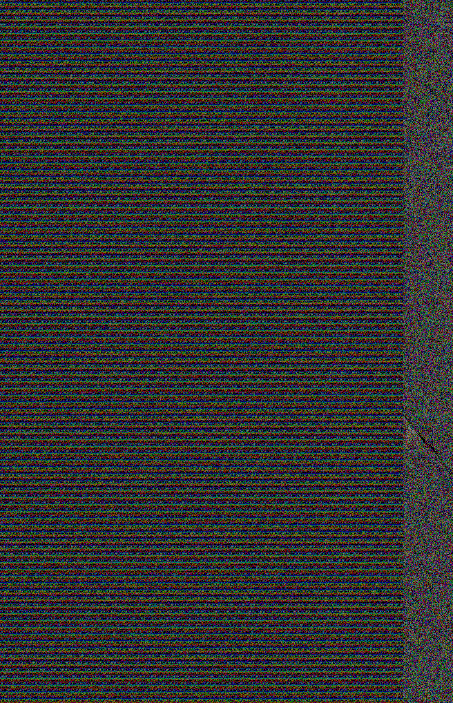

# Challenge Richelieu DGSE - Stéganographie

Suite à la partie [Cryptanalyse](./cryptanalyse.md), on a obtenu l'image suivante :


Le nom de l'image laisse supposer que l'image cache un autre fichier par une technique de stéganographie appelée [Least Significant Bit (LSB)](https://www.boiteaklou.fr/Steganography-Least-Significant-Bit.html)
Il s'agit de stocker de l'information dans les bits de poids le plus faible d'une image, ce qui passe inaperçu à l’œil nu.

Le tout est de savoir dans quelle partie de l'image l'information est stockée.

Pour ça j'ai un [petit script python](./scripts/detectLSB.py) (qui traînait dur mon disque et dont je ne suis pas l'auteur, mais j'ai oublié où je l'ai trouvé... Si vous le savez, vous pouvez m'en faire part, j'indiquerais alors l'auteur)

(Vous devez installer le package pillow de pip pour qu'il fonctionne (`pip install Pillow --user`)
```bash
python detectLSB.py -i lsb_RGB.png -o detect.png
```

On obtient l'image suivante :


On voit clairement que la partie gauche de l'image comporte de l'information : des motifs se répètent. La partie toute à droite est beaucoup plus aléatoire. La limite se situe au 1389e bit de chaque ligne. De plus il y a des stries horizontales, ce qui m'a laissé à penser que l'information est codée de haut en bas puis de gauche à droite. D'où [ce script](./scripts/extractLSB.php) que j'ai réalisé pour extraire les données.

(php-gd doit être installé)
```bash
php extractLSB.php > hexdump
```

On obtient un dump hexadécimal. Pour avoir le fichier original, il faut utiliser la commande suivante :

```bash
cat hexdump | xxd -r > executable
```

Et voilà. La partie Stéganographie est terminée. On a obtenu un fichier exécutable Linux :

```bash
file executable
executable: ELF 64-bit LSB executable, x86-64, version 1 (GNU/Linux), statically linked, stripped
```

Rendez-vous dans le section [Crackme](./crackme.md) pour découvrir comment résoudre la prochaine étape.
